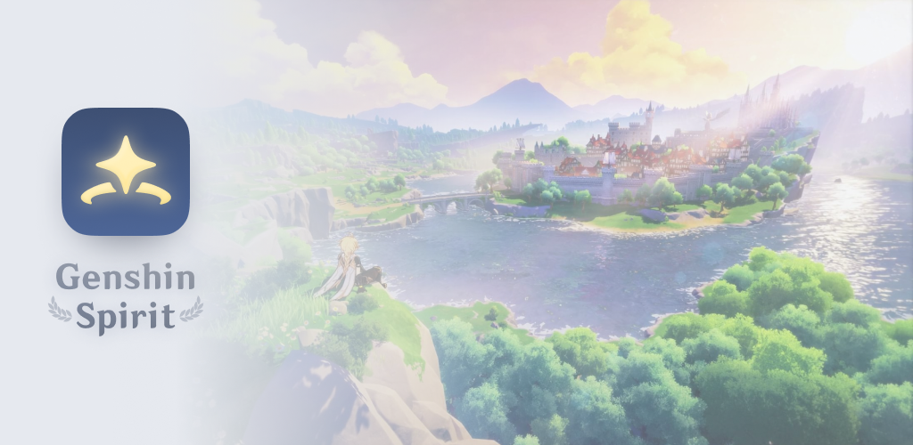
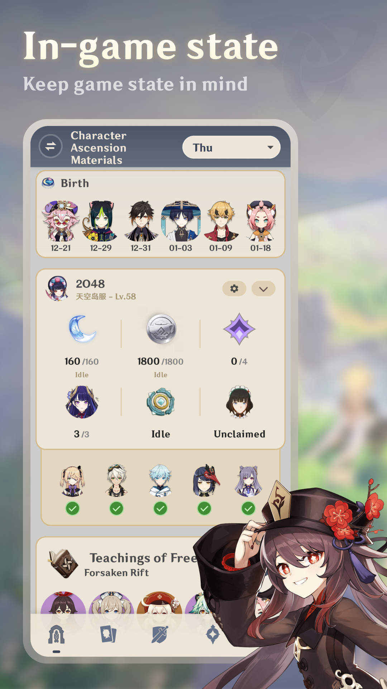
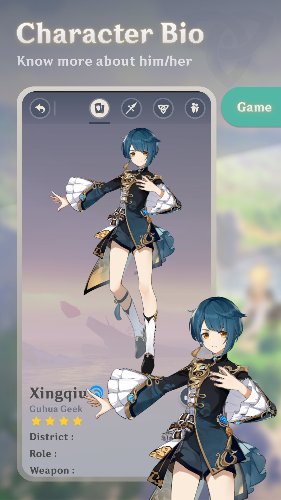
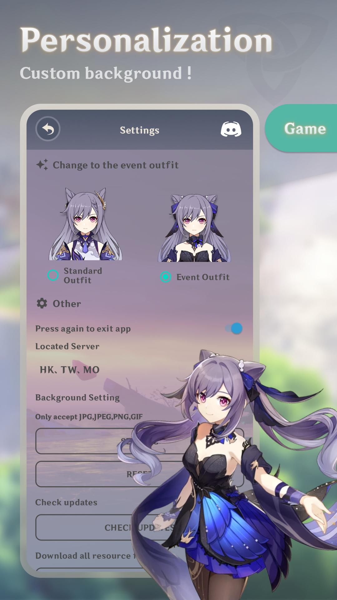
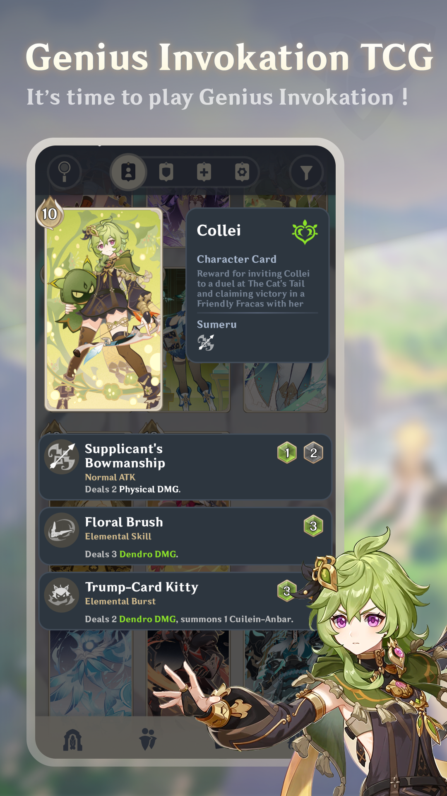

# Genshin Spirit
> An open-source project that aims to help travellers by giving different details 

### Project Organizor 

### Join our Offical Discord Server Now ~

### Get Genshin Spirit in Google Play

### Crowdin Translation Progress
].data.translationProgress&url=https%3A%2F%2Fbadges.awesome-crowdin.com%2Fstats-15282854-517440.json)
].data.translationProgress&url=https%3A%2F%2Fbadges.awesome-crowdin.com%2Fstats-15282854-517440.json)
].data.translationProgress&url=https%3A%2F%2Fbadges.awesome-crowdin.com%2Fstats-15282854-517440.json)
].data.translationProgress&url=https%3A%2F%2Fbadges.awesome-crowdin.com%2Fstats-15282854-517440.json)
].data.translationProgress&url=https%3A%2F%2Fbadges.awesome-crowdin.com%2Fstats-15282854-517440.json)
].data.translationProgress&url=https%3A%2F%2Fbadges.awesome-crowdin.com%2Fstats-15282854-517440.json)
].data.translationProgress&url=https%3A%2F%2Fbadges.awesome-crowdin.com%2Fstats-15282854-517440.json)

## We need you !
### Translator 
- If you want to help us on translating, feel free to join us through <a href="https://crowdin.com/project/genshin-spirit/invite?h=1a48d2590d5cb9d681e9911a446cb8ea1801823">Crowdin</a> ~
- If you want to translate new language, you may directly DM Voc-夜芷冰 (vocaloid2048)

### Developer
- If you are interested on helping us on developing Genshin Spirit (Android / iOS Version)
- Or developing other external products (E.g. Discord bot `SipTik-Horny` by *somebody.c*)
- Feel free to DM Voc-夜芷冰 (vocaloid2048) ~
- P.S. Android Version base on Java+XML, iOS Version still haven't any plan of it

### Beta Testers
- If you want to help us on improving user experience and debug
- Or want to try the beta version of Genshin Spirit
- Feel free to contact Voc-夜芷冰 (vocaloid2048)

## Device Suggestion
|                 | Minium                | Awesome                |
|-----------------|-----------------------|------------------------|
| Android Version | 8.0 (API 26) or above | 10.0 (API 29) or above |
| RAM             | 2GB                   | 4GB or above           |
| Storage         | 300MB                 | 1GB or above           |
| App Version     | Hmm…                  | Latest !             |

## Feature
<table>
    <tr>
        <td>
            
        </td>
        <td>
            
        </td>
        <td>
            
        </td>
        <td>
            
        </td>
    </tr>
</table>

## Home Page
### Today's Highlights :
- Available Talent Books
- Available Weapon Ascension Materials
- Character's Birthday (Easter eggs in Mid-July !)

### In-game State (DailyMemo)
User can get their in-game state without opening Genshin Impact! 
In-game state includes :
- Current Resin (With remaining time)
- Current Realm Currency (With remaining time)
- Daily Mission (Finished count and claimed)
- Weekboss (Defeated in this week)
- Dispatched Characters (With remaining time)

To try out this amazing function, you will need an account that can login via **Hoyoverse Passport**, temporatly we will not support **Third-Party Login and 米遊社 Login**

### Event List
User can get updated event information through pressing the `Event List`

## Team Page
### Character Info
Shown information of characters :
- Bio
- Battle Talents
- Passive Talents
- Constellation
- Advice (Update is coming soon!)
- Upgrade Resource Calculator

### Weapon Info
Shown information of Weapons :
- Bio
- Skill
- Upgrade Resource Calculator

### Artifact Info
Shown information of Artifacts Sets :
- Bio
- Piece(s) Buff0

## TCG Page
### TCG Info
Shown information of TCG :
- Bio
- Skills and Dice required
- Different Types of TCG Cards !

## Paimon Page
### Material Calculator
User can create a sheet for calculating materials they need on upgrading characters, weapons and artifacts
- Simply to add Characters/Weapons/Artifacts into sheet
- Renameable Sheet
- Displaying Characters/Weapons/Artifacts selected at the list
- Get the relatively accurate results of materials you will need to prepare
- Capture function for you to save sheet as PNG in your device
- Marked ✅ in Home Page/Availabe Talent Book if you choosed characters in a sheet

### Buff Calculator
- Still working on it ... Availabe in Version 4.0.0 (So that's why there have 3.A.0)

### Setting Page
A lot of customizeable choices for users :
- Background and Theme
- List Grid
- Traveler Gender
- Event Suit
- Custom Background
- Language
- Located Server [included HK, TW, MO AND 天空岛 AND 世界树]
- Random Scenery Excerpt
- More to wait for Discovery !

### Don't forget to take a look our About Page!

## Disclaim
*This application is not affiliated with miHoYo Co. Ltd. 原神小幫手(Genshin Spirit) is only an app that provides data developed by fans. The information provided in this app is for reference only. Genshin Spirit will not guarantee the accuracy and completeness of any information provided on it to any degree.*

*This application will not collect any personal privacy data that may be used to identify and track users along with other information. If necessary, the application will only collect application stack errors. The collected data is used to repair application vulnerabilities and improve user experience.*

*This project (原神小幫手 Genshin Spirit) does not object to anyone adding functions, debugging, compiling and testing, and using it for learning purposes, but this project does not allow third parties to distribute freely (whether private or public) the unofficial version [Note 1] without written permission from Voc-夜芷冰, and deliberately pretend to be the developer of this project [Note 2]. Voc-夜芷冰 reserves the right to ask individuals/institutions who violate the above conditions to be removed from the shelves after version 3.2.0 (10825).
 [Note 1] The unofficial version includes third-party self-compilation and distribution after downloading the application installation file on the cooperative platform.
 [Note 2] Discord Bot [原神小幫手] has nothing to do with this project (this project was uploaded on Github as early as September 2021, and the official version was released on Google Play in November 2021)*
